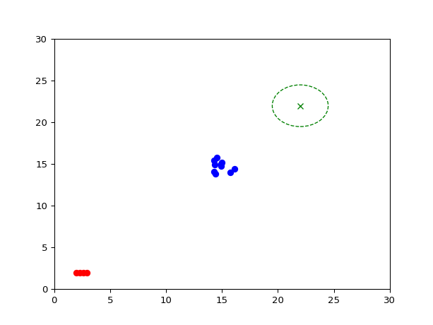

# ECS418 Project

## Installation

Install the required packages using pip:

```bash
pip install -r requirements.txt
```

## Usage

Run the main Python program:  

For environment without obstacles.
```bash
python shepherding.py
```  

For environment with obstacles.
```bash
python shepherding_with_obstacles.py
```

## Setup

1. Clone the repository
3. Install dependencies: `pip install -r requirements.txt`
4. Run the program: `python shepherding.py`
5. Number of sheep, shepherds, and iterations can be adjusted in `shepherding.py` and `shepherding_with_obstacles.py`.

## GIF Output
The simulation will generate a GIF file named `herding_simulation.gif` in the current directory.
